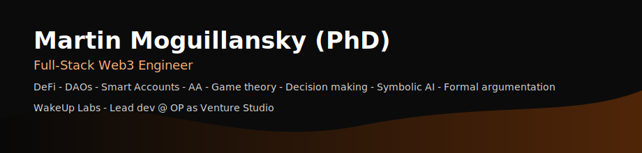

<!-- Header SVG (Orange & Black) -->

  

 

📝 <em>Note: Language stats reflect personal repos only. Most Python/FastAPI work is in organization repositories or forks.</em>

 

## 👨‍💻 About Me

I engineer end-to-end **decentralized applications (dApps)** focused on DeFi infrastructure, cross-chain interoperability, and protocol reliability, combining smart-contract architecture with scalable backend systems. My work centers on EVM-based protocols, canonical PostgreSQL schemas, and asynchronous Python/FastAPI indexers optimized for real-time data ingestion across multiple chains.
I also build keeper bots and automation pipelines powered by Safe-based batched transactions, and design Account Abstraction flows that merge security, UX simplicity, and verifiable on-chain logic.

### 🔧 Technical Stack

- **Frontend:** `React`, `Next.js`, `TypeScript`, `Redux-Saga`, `Tailwind CSS`, `Ethers.js`, `Viem`, `Wagmi`, `Tanstack`

 

- **Backend:** `NestJS`, `Node.js`, `Python` (FastAPI, Asyncio, Web3.py)

 

- **Smart Contracts (EVM):** `Solidity`, `Foundry`, `Hardhat`, `The Graph` (AssemblyScript), `OpenZeppelin`, TokenBase's AM-Bridge
- **Wallets / Protocols:** `Safe` (4337), `Privy`, `Coinbase CDP`, `Thirdweb`, `Snapshot`, `SafeSnap`

 

- **Data / Infra:** `PostgreSQL`, `Supabase`, `Redis` Message broker, `Websockets`, `Docker`, `Render`, `Netlify`, `Heroku`, `Firebase`

 

- **DevOps / CI-CD:** `GitHub Actions`, `Docker Compose`

 

- **Analytics:** `Numpy`, `Pandas`, `Matplotlib`, `Seaborn`

 

### 🔧 EIP/ERC Experience

- **EIP-712** – Typed-data signing and off-chain signature verification
- **EIP-7702** – Pectra's emerging smart-account and batch execution standards
- **EIP-4337** – Account abstraction and Safe-based batch workflows
- **EIP-2612 / Permit2** – Off-chain ERC-20 approvals and delegated transfers
- **ERC-1155** – Multi-token permissioned access control
- **ERC-4626 / ERC-7540** – Tokenized vaults, async deposit/withdraw settlement

 

## 🚩 Web3 Open Source Projects

### 💎 OP as Venture Studio - DAMM Capital — Lagoon (Backend)

**Role:** Lead Developer @ **WakeUp Labs & DAMM Capital**

**Stack:** `Python` `FastAPI` `PostgreSQL` `Docker` `Render` `Solidity` `Safe SDK`

**Key Features:**

- 🗄️ Canonical **Postgres data model** for multichain Lagoon vaults: `events` → specialized request tables with partitioned **snapshots** for analytics
- ⚡ High-throughput **FastAPI indexer** that normalizes on-chain events and powers dashboards and APIs
- 🤖 **Keeper bot** automating settlement via **Safe** batched transactions with resilient retry & logging

### 💎 OP as Venture Studio - DAMM Capital (Frontend)

**Role:** Lead Developer @ **WakeUp Labs**

**Stack:** `Typescript` `React` `Tanstack` `Privy`

**Key Features:**

- 🔐 **Account Abstraction (EIP 4337):** Privy smart wallet integration for easy user onboarding specifically for the **Lagoon vaults** flow interaction

---

### 🌍 DAMM World — Mini-app

**Role:** Lead Developer @ **DAMM Capital**

**Stack:** `Next.js` `TypeScript` `Safe Smart Accounts`

Smart-account driven World mini-app for vault interaction and AMM strategies. Onboarding designed around **Safe Smart Accounts** for consistent UX across wallet types.

---

### 🦋 Libélula Space

**Stack:** `NestJS` `IPFS` `EIP‑712` `Solidity (ERC‑1155)`

Decentralized **privacy vault** system featuring:

- Token‑gated encrypted vaults
- Client-side key derivation
- Schema versioning for content metadata

 

---

### 👤 Proof of Humanity v2 (PoHv2)

**Role:** Lead Developer @ **Kleros**

Led development and migration tooling including governance automation, cross-chain operability, and comprehensive registry management.

 
 

 

## 🔧 Experience Highlights

- **WakeUp Labs (From Sep, 2025).** Full-stack Web3 dev. `React`, `Typescript`, `Tanstack`, `Postgresql`, `Solidity`, `Foundry`, `Privy sdk`, `Python`, `FastAPI`, `Custom Indexers`, `Render`
- **DAMM Capital (May to Sep, 2025).** Full-stack Web3 dev. `Nextjs`, `React`, `Typescript`, `Postgresql`, `Solidity`, `Foundry`, `Safe sdk`, `Python`, `FastAPI`, `Redis`, `Custom Indexers`, `Netlify`, `Render`
- **Libélula (Mar to May, 2025).** Full-stack Web3 dev. `Nextjs`, `React`, `Typescript`, `Supabase`, `Solidity`, `Foundry`, `The Graph` (subgraphs), `Nodejs`, `Nestjs`, `Netlify`, `Render`
- **Kleros (2023-2025).** Full-stack Web3 dev. `Nextjs`, `React`, `Typescript`, `Supabase`, `Solidity`, `Hardhat`, `The Graph` (subgraphs), `Nodejs`, `Nestjs`, `Netlify`
- **Quasar Legal (2020-2023).** Full-stack dev. `React`, `Python`, `Heroku`, `Auth0`
- **Legal Doctor (2019).** Full-stack dev. `React`, `Heroku`
- **CONICET (2012-2023).** Research scientist with focus on AI applied to legal reasoning

## 🎓 Education & Background

- **Post-doc (Fulbright) @ University of Pittsburgh**. AI & Law.
- **Ph.D. in Computer Science (AI & Law) / Software Engineer**. Research expertise in **symbolic AI** and **formal argumentation** applied to legal reasoning. Mixed formal reasoning and rigorous mathematical thinking into protocol design, ensuring both technical excellence and logical soundness in every formal system I built.
- **M.Sc. in Law / Legal reasoning**. Research specialization in legal argumentation with a focus in sujective reasoning, legal interpretation, discretionality and proof standardization models.
- **B.Sc. Computer Science / Software Engineering**. Research expertise in **symbolic AI** and **belief revision**.

 

&color=FF6A00&line=FF6A00&point=FF6A00&bg_color=0b0b0b&height=300&width=200>)

 

## 📫 Contact & Connect

---

<!-- ### ⚡ Currently working on

Building the next generation of DeFi infrastructure with Account Abstraction and smart account integrations.
 -->

### 🤝 Open to

Collaborations on DeFi protocols, Web3 infrastructure projects, and innovative blockchain solutions.

---

⭐️ **Star this repo if you find my work interesting!**

